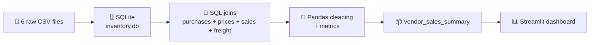

<div align="center">

# 📊 Vendor Performance Analytics

### From raw purchase & sales CSVs → SQL analysis → an interactive Streamlit dashboard


<br/>

👨‍💻 **Made by [Sayan](https://www.linkedin.com/in/sayanpal04)**

[](https://www.linkedin.com/in/sayanpal04)

</div>

---

## 🌈 Overview

This project answers a simple business question: **which vendors and brands make us money, and which ones drag us down?**

It has two parts:

| Part | File | What it does |
|------|------|--------------|
| 🔍 **Exploration** | `EDA.ipynb` | Loads six raw CSV files into SQLite, joins them with SQL and builds a vendor-level summary with profitability metrics |
| 🎨 **Dashboard** | `app.py` | A Streamlit app that visualizes vendor and brand performance from the processed summary files |

---

## ✨ Dashboard Features

- 💰 **KPI cards**: Total Sales, Total Purchase, Gross Profit, Profit Margin and Total Vendors
- 🏆 **Top 10 Vendors** and **Top 10 Brands** by sales
- 🍩 **Purchase Contribution**: donut chart of the top 10 vendors by purchase value
- ⚠️ **Low Performing Vendors and Brands**, shown by profit margin
- 🔵 **Sales vs Profit Margin** scatter plot with vendors colored by performance tier
- 📐 **Performance Summary** showing the top 25% and bottom 25% sales thresholds

### 🚦 Vendor Performance Tiers

Vendors are classified by where their total sales fall in the distribution:

| Tier | Rule | Color |
|------|------|-------|
| 🟢 **Top Performing** | Sales ≥ 75th percentile | Teal |
| 🔵 **Average** | Between the 25th and 75th percentile | Indigo |
| 🔴 **Low Performing** | Sales ≤ 25th percentile | Rose |

---

## 🧪 The EDA Notebook

`EDA.ipynb` walks through the full analysis pipeline:



### 📂 Raw input files

| File | Contents |
|------|----------|
| `begin_inventory.csv` | Inventory at the start of the period |
| `end_inventory.csv` | Inventory at the end of the period |
| `purchases.csv` | Purchase records by vendor and brand |
| `purchase_prices.csv` | Actual price and volume per brand |
| `sales.csv` | Sales dollars, quantity and excise tax |
| `vendor_invoice.csv` | Vendor invoices, including freight cost |

### 🔧 What the notebook does

1. **Loads** every CSV into `inventory.db` with `to_sql`
2. **Verifies** the tables with row counts and previews
3. **Drills into a single vendor** (Vendor 4466) across purchases, prices, invoices and sales
4. **Builds summaries** using SQL CTEs: `FreightSummary`, `PurchaseSummary` and `SalesSummary`
5. **Joins them** into one `vendor_sales_summary` table and cleans it (numeric conversion, trimmed text, filled nulls)
6. **Engineers metrics** and saves the final table back to SQLite

### 🧮 Engineered metrics

| Metric | Formula |
|--------|---------|
| 💵 **GrossProfit** | `TotalSalesDollars − TotalPurchaseDollars` |
| 📈 **ProfitMargin (%)** | `GrossProfit / TotalSalesDollars × 100` |
| 🔄 **StockTurnover** | `TotalSalesQuantity / TotalPurchaseQuantity` |
| ⚖️ **SalesToPurchaseRatio** | `TotalSalesDollars / TotalPurchaseDollars` |

---

## 🗂️ Project Structure

```
Vendor_Data_Analytics_Project/
├── app.py                              # Streamlit dashboard
├── EDA.ipynb                           # Exploration + SQL analysis
├── inventory.db                        # SQLite DB created by the notebook
├── .streamlit/
│   └── config.toml                     # Light theme settings
└── data/
    ├── begin_inventory.csv             # Raw data
    ├── end_inventory.csv
    ├── purchases.csv
    ├── purchase_prices.csv
    ├── sales.csv
    ├── vendor_invoice.csv
    ├── dashboard_vendor_summary.csv    # Processed, read by app.py
    └── dashboard_brand_summary.csv     # Processed, read by app.py
```

### 📋 Columns the dashboard expects

Both processed CSVs (`dashboard_vendor_summary.csv` and `dashboard_brand_summary.csv`) must contain:

`TotalSales` · `TotalPurchase` · `GrossProfit` · `ProfitMargin`

plus `VendorName` in the vendor file and `Brand` in the brand file.

---

## 🚀 Getting Started

### 1️⃣ Clone the repo

```bash
git clone https://github.com/<your-username>/Vendor_Data_Analytics_Project.git
cd Vendor_Data_Analytics_Project
```

### 2️⃣ Install dependencies

```bash
pip install streamlit pandas plotly jupyter
```

### 3️⃣ (Optional) Re-run the analysis

Put the six raw CSVs in `data/`, then open and run the notebook:

```bash
jupyter notebook EDA.ipynb
```

### 4️⃣ Launch the dashboard

Run it from the project root so the `data/` folder and `.streamlit/` theme are found:

```bash
streamlit run app.py
```

Then open **http://localhost:8501** 🎉

---

## 🎨 Design

| Color | Hex | Used for |
|-------|-----|----------|
| 🟣 Indigo | `#4F46E5` | Primary accent, top vendors, average tier |
| 🟢 Teal | `#14B8A6` | Top brands, top-performing tier |
| 🟡 Amber | `#F59E0B` | Low-performing brands |
| 🔴 Rose | `#F43F5E` | Low-performing vendors and tier |

---

## 🛠️ Tech Stack

- **Python**: core language
- **SQLite**: staging database for the SQL analysis
- **Pandas**: cleaning and metric engineering
- **Plotly Express**: interactive charts
- **Streamlit**: dashboard framework

---

<div align="center">

⭐ If you found this project useful, consider giving it a star! ⭐

Made with 💜 by **[Sayan](https://www.linkedin.com/in/sayanpal04)**

</div>
